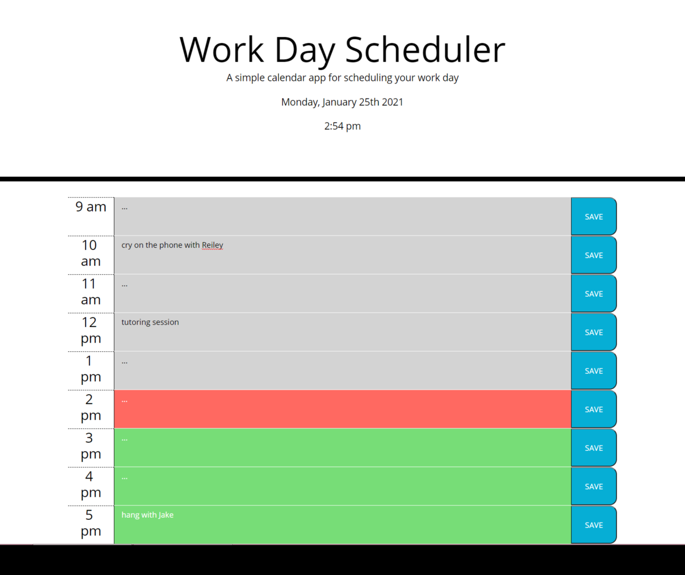
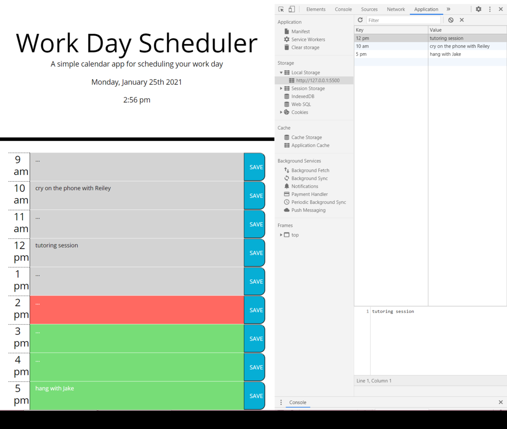

# Work Day Scheduler

# The Assignment
This week, we were given some pretty robust HTML & CSS starter code for a day planner. The task was to build the javascript, using the Moment third-party API, to give the application its functionality. The user needed to be able to add events on different time blocks throughout a standard work day (which needed to be color-coded based on whether they were in the past, present, or future), and click a save button to put them in local storage.

# Issues
* It was pretty tricky to figure out how to the text in the timeblocks to stay after refreshing the page, but Ryan and I figured it out during our tutoring session.
* I also had some trouble  thinking of how I would get the code to compare the current time to the time represented by each block. I solved this by splitting up the string from my array of timeblocks, taking the number at the front end, and adding 12 if it was under 9 to ensure we were working with the 24 hour format for our comparison. Then I just set up an ifelse statement chain using Moment's "isAfter"/"isBefore"/"isSame" methods!

# Looking Forward
If I were to come back to this application, I would like to add a clear button that allows the user to delete the events they've created without needing to open up the local storage.

<!-- Screenshot of working application -->

# Installation

Simply follow this link and view the webpage.

https://dorrianweber.github.io/work-day-scheduler/

# Usage

* Click in any of the colored text boxes to type an event. Then you can hit save to lock the events into local storage.
* Upon refreshing the page, all the events will stay there, unless you go into the local storage and clear everything.

# Credits

I was helped in this assignment by my TA Ryan Skog in our tutoring session on 1/25/21.